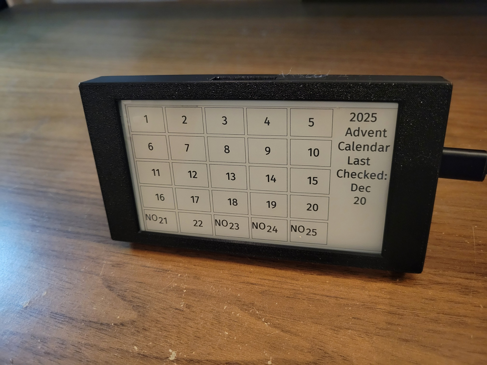
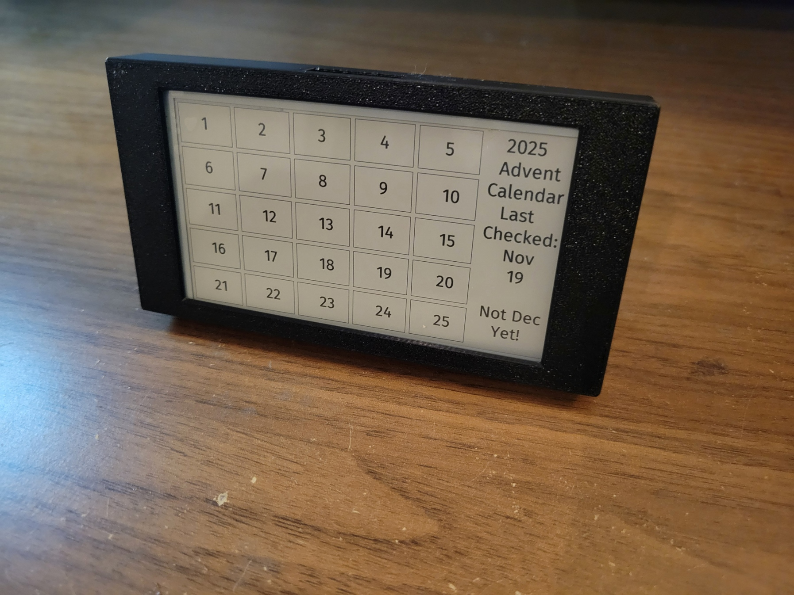

# Epaper_Advent_Calendar
<!-- Epaper Advent Calendar -->
This is an advent calendar I made for my SO for Christmas. 
Uses NTP to get the date to ensure no opening anything early. 
My SO will be leaving town so it will need to be able to connect to multiple IP addresses.

Each column is grouped,
All boxes in column 1 each contain a reason why I love my SO,
column 2 contain one of my favorite dates,
column 3 contain a funny coupon,
column 4 contains a message to ask me for a voice memo over text,
column 5 is a picture.

# Hardware
epaper display:
https://lilygo.cc/en-us/products/t5-4-7-inch-e-paper-v2-3

The STL is a modified version of this file because my display bezel was slightly bigger and my buttons were different sizes. I also added an SD card slot.
https://makerworld.com/en/models/1228204-display-housing-epaper-display-lilygo-t5-4-7-s3?from=search#profileId-1246490 

# How to use
create a file called advents.h and place your advents and name them
coupon1-5, date1-5, and love1-5

Add 3 wifi networks with SSID and password:
WIFI_SSID1-3
WIFI_PASSWORD1-3
or remove the extra wifi entries in the code

Images are inverted, then converted to .h files using images2gray.py

# TODO
*Add SD card support or grab images from the internet because there is not enough space for all the images.  
*Allow some kind of break out condition to turn touch back on. This would allow the user to select another day if they incorrectly select without having to completely reconnect to the wifi.  
*Add some debug messages to the screen for the user to see, for example if wifi doesn't connect.  
*Add Battery and wakeup support.  
*Add a small speaker to play voice messages.  